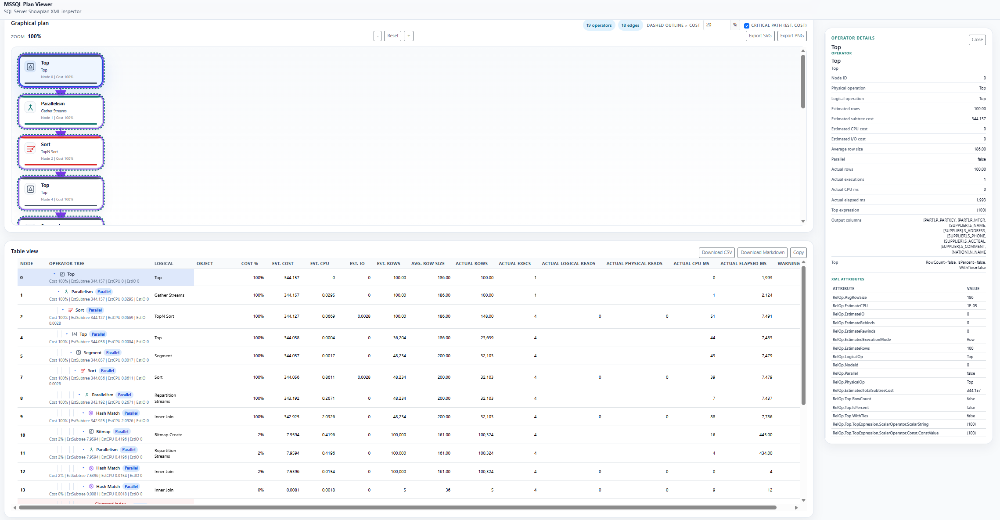

# MSSQL Plan Viewer

MSSQL Plan Viewer is a Blazor web application that parses SQL Server **Showplan XML** and presents it as a **Graphical plan / Table view / Diagnostics / Operator details / Plan details / Compare plans** experience.

## Screenshot



## Features

- Paste **Showplan XML** or load **`.sqlplan` / `.xml`** files via drag-and-drop or file picker
- Retrieve **estimated execution plans** from SQL Server by entering a connection string and query
- Load multiple plans, switch between **tabs**, and use **Compare plans**
- **Graphical plan**
  - Inline SVG rendering
  - Operator icons
  - Zoom, reset, and drag-to-scroll
  - **Dashed outline** highlight for operators above a cost threshold
  - Estimated-cost-based **critical path**
  - **SVG / PNG** download
- **Table view**
  - Hierarchical operator list
  - **CSV / Markdown / JSON** download and CSV copy
- **Diagnostics**
  - Cardinality estimate skew
  - TempDB spills
  - Expensive lookups
  - High-impact missing indexes
  - Implicit conversions
  - Memory grant mismatch
  - Stale statistics
  - Large scans with residual predicates
  - Parallel thread skew
- **Operator details / Plan details**
  - Warning details
  - Query Time Stats
  - Query Plan
  - MemoryGrantInfo
  - OptimizerHardwareDependentProperties
  - OptimizerStatsUsage
  - MissingIndexes
  - WaitStats
  - Accessed objects
  - Per-thread runtime counters
- Graphical plan node selection is synchronized with Table view, Diagnostics, and Operator details
- **Export API**
  - JSON `POST` API for automation and tool integration
  - Accepts `showplanXml` in the request body and returns downloadable files
  - `POST /api/exports/table?format=csv`
  - `POST /api/exports/table?format=md`
  - `POST /api/exports/table?format=json`
  - `POST /api/exports/graph?format=svg`
  - `POST /api/exports/graph?format=png`
- **Estimated Showplan API**
  - Accepts a connection string and query
  - Uses `SET SHOWPLAN_XML ON`, so the target query is compiled but not executed
  - `POST /api/showplans/estimated`

## Project structure

| Path | Description |
| --- | --- |
| `src\MSSQLPlanViewer.Web` | Blazor Web App (`net10.0`) |
| `src\MSSQLPlanViewer.Core` | Showplan parser, diagnostics, comparison, projection, and rendering (`net10.0`) |
| `tests\MSSQLPlanViewer.Core.Tests` | Parser, rendering, export, and API integration tests (`net10.0`) |
| `scripts\Test-PlanExportApi.ps1` | PowerShell script for export API smoke testing |

## Run locally

Install the .NET 10 SDK, then run:

```powershell
dotnet run --project .\src\MSSQLPlanViewer.Web\MSSQLPlanViewer.Web.csproj
```

The default launch profile starts the app at `http://localhost:5293`.

## Run with Docker

Build and run the web app container:

```powershell
docker build -t mssql-plan-viewer .
docker run --rm -p 5293:5293 mssql-plan-viewer
```

Open `http://localhost:5293` in your browser.

## Develop in a Dev Container

Open the repository in VS Code with the Dev Containers extension, then choose **Reopen in Container**.

Inside the container, restore and test the solution:

```bash
dotnet restore ./MSSQLPlanViewer.sln
dotnet test ./MSSQLPlanViewer.sln
```

Run the app inside the container:

```bash
dotnet run --project ./src/MSSQLPlanViewer.Web/MSSQLPlanViewer.Web.csproj --urls http://0.0.0.0:5293
```

The Dev Container forwards port `5293`, so the app is available at `http://localhost:5293`.

To debug the app, select **MSSQL Plan Viewer (Dev Container)** in VS Code and press F5.

If `bin` or `obj` permission errors appear after changing Dev Container settings, run **Dev Containers: Rebuild Container**.

## Run from a GitHub Release

1. Download `MSSQLPlanViewer-vX.Y.Z-win-x64.zip` from the GitHub Releases page.
2. Extract the ZIP.
3. Keep `wwwroot`, `appsettings.json`, and the static web assets file in the same folder as `MSSQLPlanViewer.Web.exe`.
4. Start the app:

```powershell
.\MSSQLPlanViewer.Web.exe --urls http://localhost:5293
```

5. Open `http://localhost:5293` in your browser.

## Create a GitHub Release

Pushing a `v*` tag builds a Windows x64 self-contained release ZIP and attaches it to a GitHub Release.

```powershell
git tag v0.1.0
git push origin v0.1.0
```

## Usage

1. Open `http://localhost:5293`.
2. Paste SQL Server Showplan XML into the input box, drop/select one or more `.sqlplan` / `.xml` files, or switch to **Query** and enter a SQL Server connection string plus query.
3. Click **Parse** for XML input, or **Get estimated plan** for query input. Loaded plans appear as tabs.
4. If a plan contains multiple statements, choose the active statement from the statement selector.
5. Inspect the **Graphical plan**, **Table view**, **Diagnostics**, **Plan details**, and **Operator details** panes.
6. Select an operator in the graph, table, or Diagnostics table to synchronize the focused node and details panel.
7. Use **Download CSV**, **Download Markdown**, **Download JSON**, or **Copy** in Table view to export tabular data.
8. Use **Export SVG** or **Export PNG** in Graphical plan to export the current graph.
9. Load two or more plans to compare aggregate metrics with **Compare plans**.

## Estimated plans from a query

The **Query** input mode connects to SQL Server and retrieves estimated Showplan XML with `SET SHOWPLAN_XML ON`. SQL Server compiles the query and returns the XML plan; the target query is not executed.

Requirements and behavior:

- The connection string is entered per request and is not saved by the app.
- The app does not log the connection string.
- The SQL Server login must have permission to compile the submitted query and `SHOWPLAN` permission for referenced databases.
- Use this feature only in a trusted internal deployment or behind appropriate network/application access controls.
- Submit T-SQL that SQL Server can execute as a single client command. Client-side batch separators such as `GO` are not interpreted by `Microsoft.Data.SqlClient`.

## Test

```powershell
dotnet test .\MSSQLPlanViewer.sln
```

See `docs\TEST_REPORT.md` for the test report.

## Export API

### Table export

- `POST /api/exports/table?format=csv`
- `POST /api/exports/table?format=md`
- `POST /api/exports/table?format=json`

Request body:

```json
{
  "showplanXml": "<ShowPlanXML ...>...</ShowPlanXML>",
  "statementId": "1"
}
```

### Graph export

- `POST /api/exports/graph?format=svg`
- `POST /api/exports/graph?format=png`

Request body:

```json
{
  "showplanXml": "<ShowPlanXML ...>...</ShowPlanXML>",
  "statementId": "1",
  "costHighlightThresholdPercent": 20,
  "showCriticalPath": true
}
```

The response is returned as a downloadable file. If `statementId` is omitted, the first statement is used. The `format` query parameter is required. Invalid or unsupported `format` values return `400`. Invalid XML returns `400`, and a missing statement returns `404`.

### API call specification

The Export API is intended for local automation and integration with tools that already have SQL Server Showplan XML.

| Item | Specification |
| --- | --- |
| Base URL | Same as the running web app, for example `http://localhost:5293` |
| Method | `POST` |
| Authentication | None by default |
| Request content type | `application/json` |
| Antiforgery token | Not required for `/api/exports/*` |
| Response | A downloadable file returned in the response body |

Supported endpoints:

| Endpoint | Required query | Response content type | Output |
| --- | --- | --- | --- |
| `/api/exports/table` | `format=csv` | `text/csv` | CSV table export |
| `/api/exports/table` | `format=md` or `format=markdown` | `text/markdown` | Markdown table export |
| `/api/exports/table` | `format=json` | `application/json` | JSON table export |
| `/api/exports/graph` | `format=svg` | `image/svg+xml` | SVG graph export |
| `/api/exports/graph` | `format=png` | `image/png` | PNG graph export |

Table export request body:

| Field | Type | Required | Description |
| --- | --- | --- | --- |
| `showplanXml` | string | Yes | SQL Server Showplan XML content. |
| `statementId` | string | No | Statement ID to export. If omitted, the first statement is used. |

Graph export request body:

| Field | Type | Required | Default | Description |
| --- | --- | --- | --- | --- |
| `showplanXml` | string | Yes | - | SQL Server Showplan XML content. |
| `statementId` | string | No | First statement | Statement ID to export. |
| `costHighlightThresholdPercent` | number | No | `20` | Cost percentage threshold used for dashed outline highlighting. |
| `showCriticalPath` | boolean | No | `true` | Whether to highlight the estimated-cost critical path. |

Error responses use ASP.NET Core problem details JSON.

| Status | When |
| --- | --- |
| `400` | `format` is missing or unsupported, `showplanXml` is empty, or the XML cannot be parsed. |
| `404` | The Showplan XML contains no statements, or the requested `statementId` does not exist. |

## Estimated Showplan API

- `POST /api/showplans/estimated`

Request body:

```json
{
  "connectionString": "Server=.;Database=AdventureWorks2022;Integrated Security=true;TrustServerCertificate=true;",
  "query": "SELECT TOP (10) * FROM Sales.SalesOrderHeader;",
  "label": "Sales order lookup",
  "commandTimeoutSeconds": 60
}
```

Response body:

```json
{
  "plans": [
    {
      "label": "Sales order lookup",
      "showplanXml": "<ShowPlanXML ...>...</ShowPlanXML>",
      "statementCount": 1,
      "schemaVersion": "SqlServer2022",
      "totalNodeCount": 4,
      "totalWarningCount": 0
    }
  ]
}
```

| Field | Type | Required | Default | Description |
| --- | --- | --- | --- | --- |
| `connectionString` | string | Yes | - | SQL Server connection string used only for the current request. |
| `query` | string | Yes | - | Query used to retrieve the estimated execution plan. |
| `label` | string | No | `Estimated` | Base label for returned plans. |
| `commandTimeoutSeconds` | number | No | `60` | Command timeout from `1` to `300` seconds. |

| Status | When |
| --- | --- |
| `400` | Required fields are missing, or `commandTimeoutSeconds` is outside `1` to `300`. |
| `502` | SQL Server connection, permission, compilation, or Showplan retrieval fails. |
| `504` | SQL Server does not return before the command timeout. |

## Estimated Showplan API examples

Start the app first:

```powershell
dotnet run --project .\src\MSSQLPlanViewer.Web\MSSQLPlanViewer.Web.csproj
```

Retrieve an estimated execution plan and save the first returned Showplan XML as a `.sqlplan` file:

```powershell
$baseUrl = "http://localhost:5293"
$body = @{
    connectionString = "Server=.;Database=AdventureWorks2022;Integrated Security=true;TrustServerCertificate=true;"
    query = "SELECT TOP (10) * FROM Sales.SalesOrderHeader;"
    label = "Sales order lookup"
    commandTimeoutSeconds = 60
} | ConvertTo-Json -Depth 5

$response = Invoke-RestMethod `
    -Uri "$baseUrl/api/showplans/estimated" `
    -Method Post `
    -ContentType "application/json" `
    -Body $body

$response.plans |
    Select-Object label, statementCount, schemaVersion, totalNodeCount, totalWarningCount

$response.plans[0].showplanXml |
    Set-Content .\estimated-plan.sqlplan -Encoding utf8
```

You can also save the request body and call the endpoint with `curl.exe`:

```powershell
$body | Set-Content .\estimated-showplan-request.json -Encoding utf8

curl.exe -X POST "$baseUrl/api/showplans/estimated" `
    -H "Content-Type: application/json" `
    --data-binary "@estimated-showplan-request.json" `
    -o estimated-showplan-response.json
```

The response JSON contains one or more `plans` entries. Each entry includes `showplanXml`, which can be pasted into the viewer, saved as `.sqlplan`, or sent to the Export API as `showplanXml`.

### Retrieve an estimated plan and analyze it

This example retrieves an estimated execution plan from SQL Server, then sends the returned Showplan XML to the existing Export API to produce analysis artifacts.

```powershell
$baseUrl = "http://localhost:5293"

$estimatedPlanRequest = @{
    connectionString = "Server=.;Database=AdventureWorks2022;Integrated Security=true;TrustServerCertificate=true;"
    query = "SELECT TOP (10) * FROM Sales.SalesOrderHeader;"
    label = "Sales order lookup"
    commandTimeoutSeconds = 60
} | ConvertTo-Json -Depth 5

$estimatedPlanResponse = Invoke-RestMethod `
    -Uri "$baseUrl/api/showplans/estimated" `
    -Method Post `
    -ContentType "application/json" `
    -Body $estimatedPlanRequest

$plan = $estimatedPlanResponse.plans[0]
$plan.showplanXml | Set-Content .\estimated-plan.sqlplan -Encoding utf8

$analysisRequest = @{
    showplanXml = $plan.showplanXml
} | ConvertTo-Json -Depth 5

Invoke-WebRequest `
    -Uri "$baseUrl/api/exports/table?format=csv" `
    -Method Post `
    -ContentType "application/json" `
    -Body $analysisRequest `
    -OutFile .\estimated-plan-table.csv

Invoke-WebRequest `
    -Uri "$baseUrl/api/exports/graph?format=svg" `
    -Method Post `
    -ContentType "application/json" `
    -Body $analysisRequest `
    -OutFile .\estimated-plan-graph.svg
```

Open `estimated-plan.sqlplan` in the web UI to inspect the same plan with the graphical viewer, table view, diagnostics, plan details, and operator details.

## Export API examples

Start the app first:

```powershell
dotnet run --project .\src\MSSQLPlanViewer.Web\MSSQLPlanViewer.Web.csproj
```

The examples below use `tests\MSSQLPlanViewer.Core.Tests\Samples\nested-loops-2022.sqlplan`.

Export the table view as CSV:

```powershell
$baseUrl = "http://localhost:5293"
$xml = Get-Content .\tests\MSSQLPlanViewer.Core.Tests\Samples\nested-loops-2022.sqlplan -Raw
$body = @{
    showplanXml = $xml
} | ConvertTo-Json -Depth 5

Invoke-WebRequest `
    -Uri "$baseUrl/api/exports/table?format=csv" `
    -Method Post `
    -ContentType "application/json" `
    -Body $body `
    -OutFile .\plan-table.csv
```

Export the table view as Markdown for a specific statement:

```powershell
$body = @{
    showplanXml = $xml
    statementId = "1"
} | ConvertTo-Json -Depth 5

Invoke-WebRequest `
    -Uri "$baseUrl/api/exports/table?format=md" `
    -Method Post `
    -ContentType "application/json" `
    -Body $body `
    -OutFile .\plan-table.md
```

Export the table view as JSON:

```powershell
Invoke-WebRequest `
    -Uri "$baseUrl/api/exports/table?format=json" `
    -Method Post `
    -ContentType "application/json" `
    -Body $body `
    -OutFile .\plan-table.json
```

Export the graphical plan as SVG:

```powershell
$body = @{
    showplanXml = $xml
    costHighlightThresholdPercent = 20
    showCriticalPath = $true
} | ConvertTo-Json -Depth 5

Invoke-WebRequest `
    -Uri "$baseUrl/api/exports/graph?format=svg" `
    -Method Post `
    -ContentType "application/json" `
    -Body $body `
    -OutFile .\plan-graph.svg
```

Export the graphical plan as PNG:

```powershell
Invoke-WebRequest `
    -Uri "$baseUrl/api/exports/graph?format=png" `
    -Method Post `
    -ContentType "application/json" `
    -Body $body `
    -OutFile .\plan-graph.png
```

You can also save the JSON request body and call the API with `curl.exe`:

```powershell
$body | Set-Content .\graph-request.json -Encoding utf8
curl.exe -X POST "http://localhost:5293/api/exports/graph?format=svg" `
    -H "Content-Type: application/json" `
    --data-binary "@graph-request.json" `
    -o plan-graph.svg
```

## Verify the API with PowerShell

`scripts\Test-PlanExportApi.ps1` calls all five endpoints and saves the returned files.

```powershell
pwsh -File .\scripts\Test-PlanExportApi.ps1
```

Or:

```powershell
powershell -NoProfile -ExecutionPolicy Bypass -File .\scripts\Test-PlanExportApi.ps1
```

Main parameters:

- `-BaseUrl`
- `-ShowplanPath`
- `-ShowplanXml`
- `-OutputDirectory`
- `-StatementId`
- `-CostHighlightThresholdPercent`
- `-ShowCriticalPath`

If `-ShowplanXml` is provided, the script uses that string directly. Otherwise it uses `-ShowplanPath`. If neither is provided, it falls back to `tests\MSSQLPlanViewer.Core.Tests\Samples\nested-loops-2022.sqlplan`.

## Implementation notes

- `ShowplanParser` uses `XDocument` and `LocalName` so it can handle XML namespace differences.
- Parser, diagnostics, graph, table, comparison, and export logic live in `MSSQLPlanViewer.Core` to keep UI dependencies minimal.
- Blazor Server receive message size is increased to `10 MB`.
- Graph export uses a shared server-side SVG renderer, and PNG export rasterizes that SVG output.

## License

This project is licensed under the MIT License. See `LICENSE` for details.

Third-party notices are listed in `THIRD-PARTY-NOTICES.md`.
